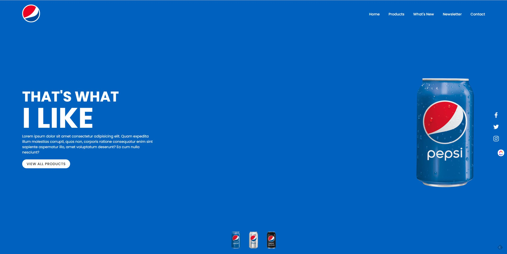
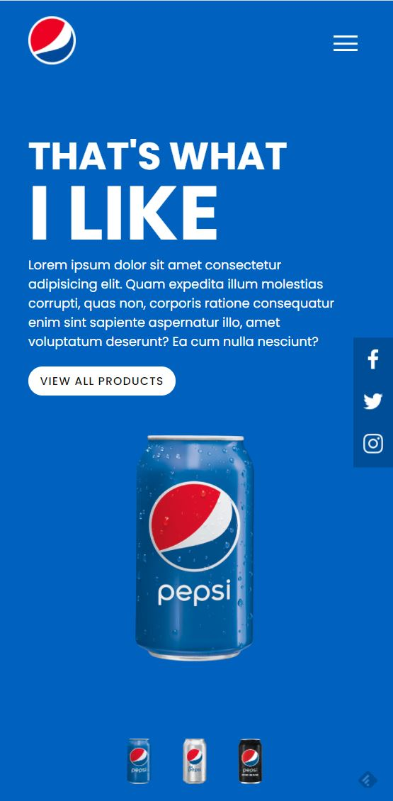
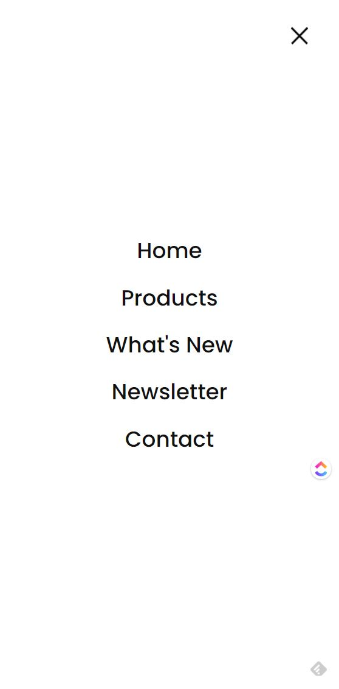

# Pepsi - Landing Page

# Pepsi - Landing Page Mobile
| Toggle Menu (1)  | Toggle Menu (2) |
| ------------- | ------------- |
|  |   |

## 🚀 Tecnologies

This project was developed using the following technologies:

- <strong>[HTML5]</strong>
- <strong>[CSS3]</strong>
- <strong>[JavaScript]</strong>

## 💻 Project

This personal project developed exclusively for portfolio purposes, and to demonstrate practical knowledge in the Front End development area.

## 🔖 Layout

You can view the project layout through the links below:

- [Layout Web](https://www) 

## 📝 License

This project is under the MIT license. See the archive [LICENSE](LICENSE.md) for more details.

---

Developed by Marcos Vinicius Nulman

 
